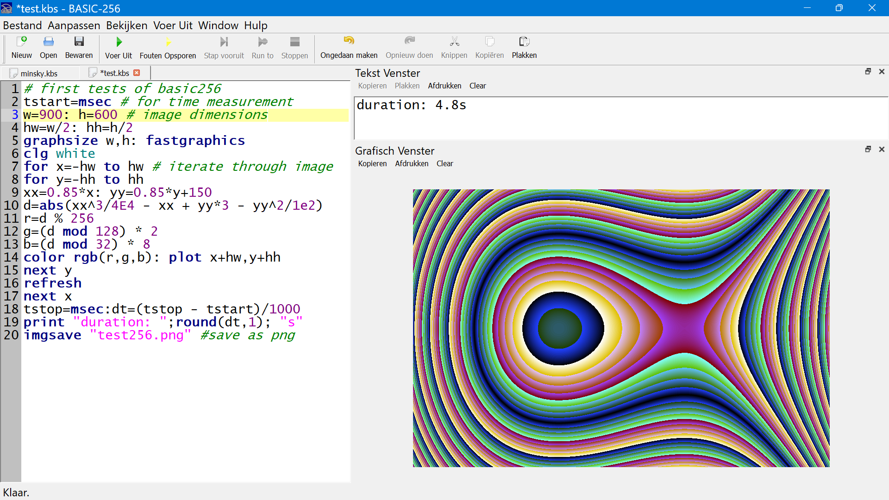
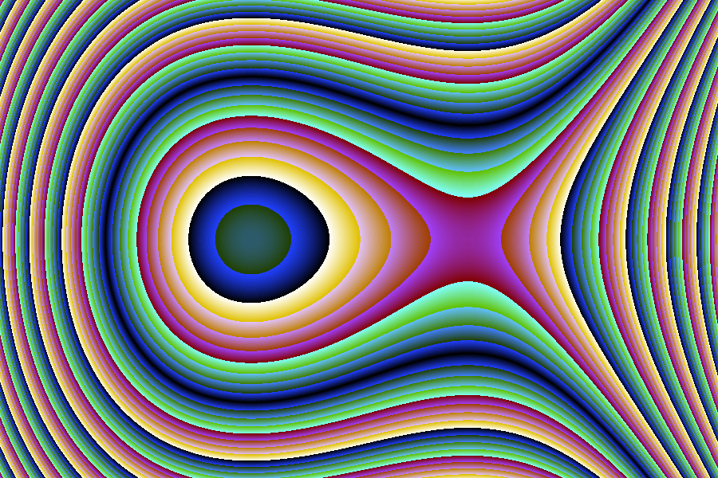
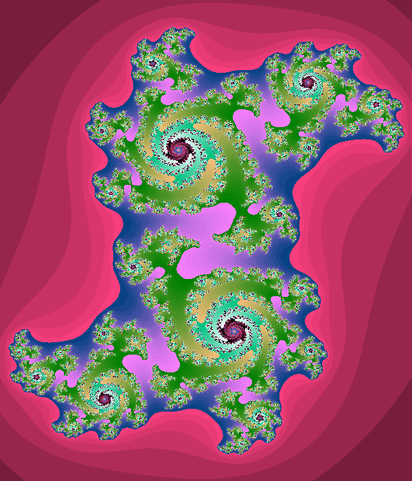
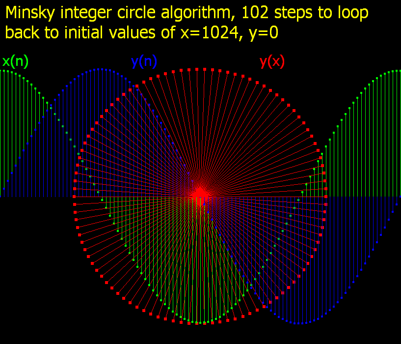
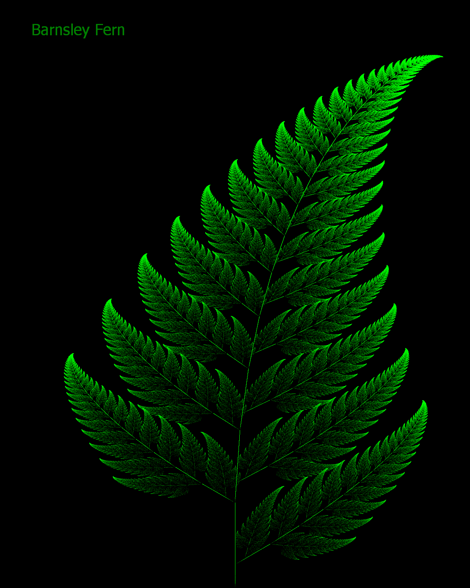

# BASIC-256
Basic programming using [BASIC-256](https://basic256.org/)

## First test of BASIC-256

Using the graphics output and measuring the execution time.

The code: [test256.kbs](test256.kbs)

The IDE of BASIC-256 with the program:

The output saved to PNG by the program:

## Julia Fractal

Drawing a Julia fractal. The code takes about 21s to complete. It calculates half of the fractal and plots the other half from the same data using symmetry.

The code: [julia.kbs](julia.kbs)

The output saved to PNG by the program:

## Minsky Circle Algorithm

Drawing a circle using only addition, subtraction and integer division.

The main loop:

    x=1024: y=0 # initial values
    do
        x = x - y\32 # using integer division
        y = y + x\16 # new value of x has to be used
	    x = x - y\32 # 3rd step to reduce phase error
		plot(x,y)
    until x=1024 and y=0 # until back to initial values

The integer division by powers of 2 could be done using bit shift to the right also.

Using info from: ["Drawing Circles · Hrvoje's Blog"](https://blog.hrvoje.org/2020/05/drawing-circles/)

The code: [minsky.kbs](minsky.kbs)

## Duoble Pendulum

Attempting to simulate a double pendulum using BASIC-256.

Using equations found at: [https://www.physics.usyd.edu.au/~wheat/dpend_html/](https://www.physics.usyd.edu.au/~wheat/dpend_html/)

The code: [double_pendulum.kbs](double_pendulum.kbs)

A GIF screen recording of the animation:

## Barnsley Fern

This algorithm generates an image of a fern.

Using infirmation from [the wikipedia article](https://en.wikipedia.org/wiki/Barnsley_fern)

It applies 4 possible transformations on the coordinates of a point x,y. The probabilities of these four being choosen differ for transformation.

The following code is iterated many times, each iteration one out of four tranformations are applied and one point is plotted.

    r = rand() # value between 0 and 1
	begin case # choose 1 out of 4 possible transforms
	case r < 0.01 # probability 1%
		xn = 0.0
		y = 0.16 * y
	case r < 0.86 # probability 85%
		xn = 0.85 * x + 0.04 * y
		y = -0.04 * x + 0.85 * y + 1.6
	case r < 0.93 # probability 7%
		xn = 0.2 * x - 0.26 * y
    	y = 0.23 * x + 0.22 * y + 1.6
	else # probability 7%
		xn = -0.15 * x + 0.28 * y
    	y = 0.26 * x + 0.24 * y + 0.44
	end case
	x = xn
	call plotpoint(x,y,xscale,yscale,hw,h)

The code: [barnsley_fern2.kbs](barnsley_fern2.kbs)

The generated image:

