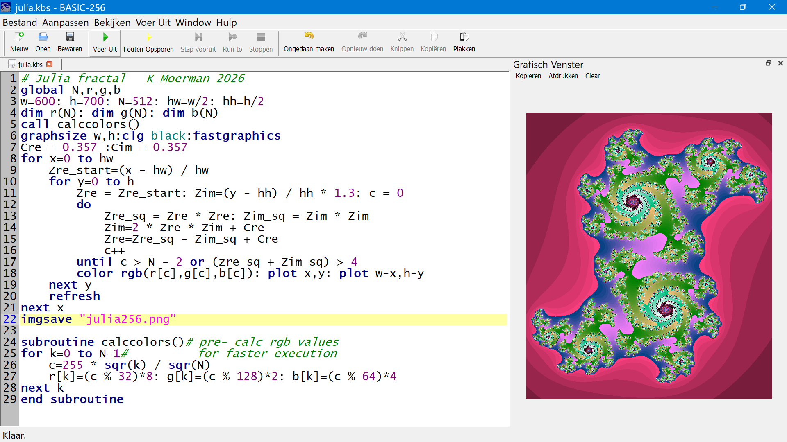

# BASIC-256
Basic programming using [BASIC-256](https://basic256.org/)

## First test of BASIC-256

Using the graphics output and measuring the execution time.

The code: [test256.kbs](test256.kbs)

The IDE of BASIC-256 with the program:

The output saved to PNG by the program:

## Julia Fractal

Drawing a Julia fractal. The code takes about 21s to complete. It calculates half of the fractal and plots the other half from the same data using symmetry.

The code: [julia.kbs](julia.kbs)

The IDE with the code:

The output saved to PNG by the program:

